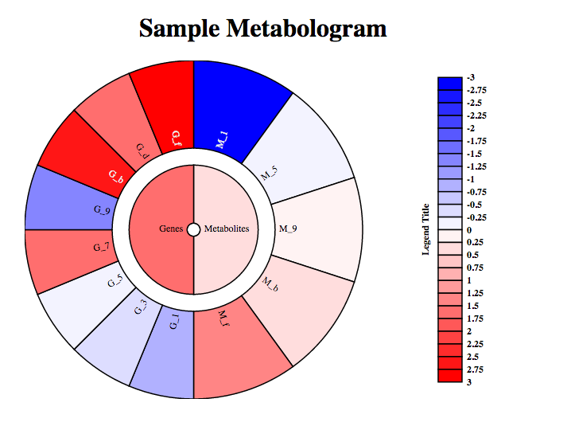

[](http://dx.doi.org/10.5281/zenodo.13949)

## Install
This package is currently not on CRAN, but you can install it from GitHub via `devtools`:

```r
library("devtools");
devtools::install_github("armish/metabologram");
```

## Plotting
```r
library("metabologram");
metabologram(
	sampleMetabologramData, 
	width=600, 
	height=500, 
	main="Sample Metabologram",
	showLegend=TRUE,
	fontSize=12,
	legendBreaks=sampleMetabologramBreaks,
	legendColors=sampleMetabologramColors,
  legendText="Legend Title"
);
```



## Sample Data

```r
sampleMetabologramData <- list(
  list(
    name="Metabolites",
    colour="#FFDDDD",
    children=list(
      list(name="M_1", colour="#0000FF"),
      list(name="M_5", colour="#F3F3FF"),
      list(name="M_9", colour="#FFF3F3"),
      list(name="M_b", colour="#FFDDDD"),
      list(name="M_f", colour="#FF8585")
    )
  ),
  list(
    name="Genes",
    colour="#FF6E6E",
    children=list(
      list(name="G_1", colour="#B1B1FF"),
      list(name="G_3", colour="#DDDDFF"),
      list(name="G_5", colour="#F3F3FF"),
      list(name="G_7", colour="#FF6E6E"),
      list(name="G_9", colour="#8585FF"),
      list(name="G_b", colour="#FF1616"),
      list(name="G_d", colour="#FF6E6E"),
      list(name="G_f", colour="#FF0000")
    )
  )
);

sampleMetabologramBreaks <- c(
  -3.00, -2.75, -2.50, -2.25, -2.00, -1.75, -1.50, -1.25, -1.00, 
  -0.75, -0.50, -0.25, 0.00,  0.25,  0.50,  0.75,  1.00,  
  1.25,  1.50,  1.75,  2.00,  2.25,  2.50,  2.75, 3.00
);

sampleMetabologramColors <- c(
  "#0000FF", "#1616FF", "#2C2CFF", "#4242FF", "#5858FF", "#6E6EFF", "#8585FF",
  "#9B9BFF", "#B1B1FF", "#C7C7FF", "#DDDDFF", "#F3F3FF", "#FFF3F3", "#FFDDDD",
  "#FFC7C7", "#FFB1B1", "#FF9B9B", "#FF8585", "#FF6E6E", "#FF5858", "#FF4242",
  "#FF2C2C", "#FF1616", "#FF0000"
);

```

## Credits
This version of the wheel was adapted from [Jason Davies's Coffee Wheel example](https://www.jasondavies.com/coffee-wheel/). 
Built with [D3.js](http://d3js.org/). Sunburst zooming based on an [example](http://bl.ocks.org/mbostock/4348373) by [Mike Bostock](http://bost.ocks.org/mike).
